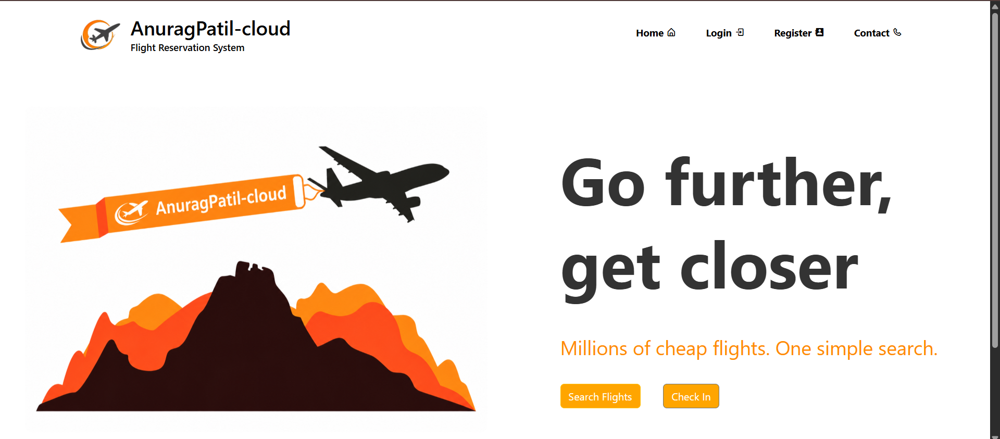
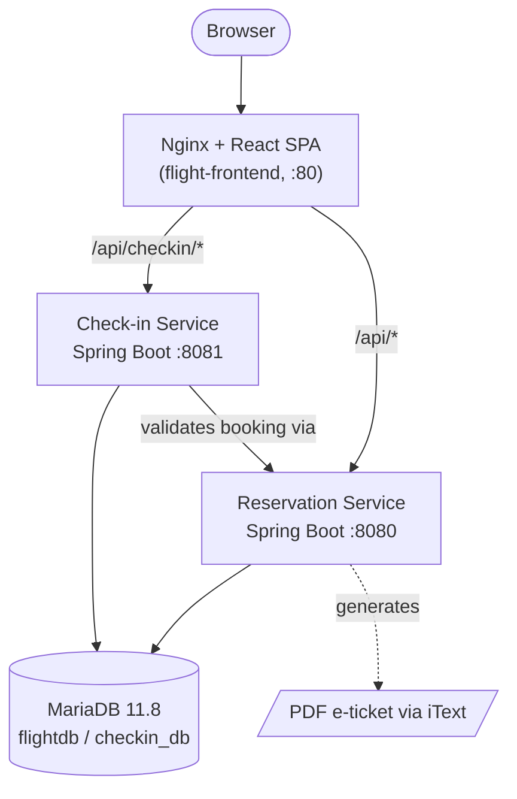
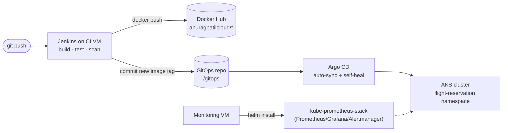

# ✈️ Flight Reservation Application — Azure/AKS Edition

A full-stack flight reservation and check-in platform, built as a microservices system and shipped to production with an end-to-end DevOps pipeline: Terraform-provisioned Azure infrastructure, Jenkins CI, Docker, GitOps with Argo CD on AKS, and Prometheus/Grafana monitoring.

<p align="center">
  
</p>

<p align="center">
  
  
  
  
  
  
  
  
  
  
</p>

---

## Table of contents

- [Overview](#overview)
- [Features](#features)
- [Application screenshots](#application-screenshots)
- [Architecture](#architecture)
- [Tech stack](#tech-stack)
- [Repository layout](#repository-layout)
- [API reference](#api-reference)
- [Infrastructure (Terraform)](#infrastructure-terraform)
- [CI/CD pipeline (Jenkins)](#cicd-pipeline-jenkins)
- [GitOps deployment (Argo CD + AKS)](#gitops-deployment-argo-cd--aks)
- [Monitoring](#monitoring)
- [Getting started locally](#getting-started-locally)
- [Deploying to Azure](#deploying-to-azure)
- [Security notes](#security-notes)
- [Roadmap](#roadmap)
- [Author](#author)

---

## Overview

This project is a **flight booking and check-in system** split into three independently deployable services — a React SPA, a reservation backend, and a check-in backend — backed by a shared MariaDB database. It doubles as a reference implementation of a **production-style Azure DevOps pipeline**: infrastructure as code, containerized builds, automated testing, GitOps-driven continuous delivery, and cluster observability.

Everything from provisioning the Azure resource groups to promoting a new container image into the running AKS cluster is automated and captured with real screenshots below.

## Features

**Traveller-facing**
- Register / log in with JWT-based authentication
- Search flights by origin, destination, and date
- Book a flight and view a personal booking list
- Download a generated PDF e-ticket for a booking
- Self-service profile view and update
- Online check-in with baggage count, decoupled into its own service

**Admin-facing**
- Admin login (separate authentication guard from traveller login)
- Create, update, and delete flights
- View the full flight list and the list of registered admins
- Add additional admin accounts

**Platform**
- Stateless JWT auth shared across two independent Spring Boot services
- Nginx-based single-origin routing so the SPA never deals with CORS
- Fully automated build → scan → image → deploy pipeline
- Self-healing, auto-synced GitOps deployment
- Cost guardrails (Azure budget + alert thresholds) and email alerting baked into the infrastructure code

## Application screenshots

| Home | Login | Register |
|---|---|---|
|  |  |  |

| Search flights | Profile | Contact |
|---|---|---|
|  |  |  |

## Architecture



The frontend is served by **Nginx on port 80** and acts as the single origin for the browser. It reverse-proxies:

- `/api/checkin/*` → `flight-checkin-service:8081`
- `/api/*` → `flight-reservation-service:8080`
- everything else → the React static build (SPA fallback)

This means the UI never needs to know the backend service addresses at runtime — only Nginx does — which keeps the two backend services free to move, scale, or restart independently.

### Delivery pipeline



## Tech stack

| Layer | Technology |
|---|---|
| Frontend | React 19, Vite 6, React Router 7, Redux Toolkit, Axios, React Toastify, Boxicons |
| Reservation service | Java 17, Spring Boot 3.3.5, Spring Security, Spring Data JPA, JJWT, iTextPDF |
| Check-in service | Java 17, Spring Boot 3.3.5, Spring Security, Spring Data JPA, JJWT |
| Database | MariaDB 11.8 (two logical schemas: `flightdb`, `checkin_db`) |
| Containers | Docker, Nginx (frontend static/reverse proxy), Eclipse Temurin JRE (backend) |
| Infrastructure as Code | Terraform (modular: network, VM, AKS, storage, alerting, budgets) |
| Cloud | Microsoft Azure (AKS, Virtual Machines, Storage, Monitor, Consumption Budgets) |
| CI | Jenkins (self-hosted on an Azure VM), SonarQube, Trivy-ready pipeline |
| CD / GitOps | Argo CD (auto-sync, self-heal, prune) |
| Orchestration | Azure Kubernetes Service (AKS), Kustomize-style manifests |
| Monitoring | kube-prometheus-stack (Prometheus, Grafana, Alertmanager) via Helm |

## Repository layout

```
flight-reservation-app-Azure/
├── frontend/                      # React + Vite SPA, Nginx Dockerfile
├── FlightReservationApplication/  # Spring Boot: users, flights, bookings, PDF tickets
├── FlightCheckInApplication/      # Spring Boot: check-in workflow
├── gitops/                        # Kubernetes manifests (Kustomize), synced by Argo CD
├── argocd-application.yaml        # Argo CD Application definition
├── terraform/                     # Azure IaC (network, vm, aks, storage, sns, budgets modules)
├── monitoring/                    # kube-prometheus-stack values + setup notes
├── docs/                          # Jenkins credentials setup notes
├── FRA-SCREENSHOTS/               # Screenshots used in this README
├── Jenkinsfile                    # Root CI/CD pipeline
└── README-DEPLOYMENT.md           # Detailed one-time deployment runbook
```

## API reference

### User service — `/api/users` (Reservation app)

| Method | Endpoint | Description |
|---|---|---|
| POST | `/register` | Register a new user |
| POST | `/login` | Authenticate and receive a JWT |
| GET | `/{id}` | Fetch a user by ID |
| GET | `/userList` | List all registered users |
| PUT | `/update/{id}` | Update a user's profile |

### Flight service — `/api/flights` (Reservation app)

| Method | Endpoint | Description |
|---|---|---|
| POST | `/create` | Add a new flight (admin) |
| GET | `/all` | List all flights |
| GET | `/search` | Search flights by origin, destination, date |
| PUT | `/update/{id}` | Update a flight (admin) |
| DELETE | `/delete/{id}` | Remove a flight (admin) |

### Booking service — `/api/bookings` (Reservation app)

| Method | Endpoint | Description |
|---|---|---|
| POST | `/book` | Create a booking |
| GET | `/user/{userId}` | List a user's bookings |
| GET | `/details/{bookingId}` | Get a single booking's details |
| GET | `/download-ticket/{bookingId}` | Download the e-ticket as a generated PDF |

### Check-in service — `/api/checkin` (Check-in app)

| Method | Endpoint | Description |
|---|---|---|
| POST | `/{bookingId}` | Check in a booking (`numberOfBags` param, JWT bearer token); the service validates the booking against the reservation service before completing check-in |

## Infrastructure (Terraform)

Provisioning is split into composable modules under `terraform/modules/`:

| Module | Provisions |
|---|---|
| `network` | Resource group, VNet, and subnets (used twice — once for the VM network, once for the AKS network) |
| `vm` | Two Linux VMs — a **CI VM** (Jenkins, Docker, Maven, Terraform, Azure CLI) and a **monitoring/admin VM** (kubectl, Helm, Argo CD CLI, Azure CLI) — each with its own public IP and NSG |
| `aks` | The AKS cluster (system-assigned identity, configurable node VM size) |
| `storage` | An Azure Storage account/container for shared artifacts |
| `sns` | An Azure Monitor Action Group for email alerting |
| `budgets` | A monthly Azure subscription budget with 80%/100% threshold notifications |

The VM and AKS workloads live in **separate virtual networks** with their own resource groups, so the always-on cluster and the more elastic CI/monitoring VMs can be sized, budgeted, and torn down independently.

<p align="center">
  
</p>

<p align="center">
  
</p>

Applying the stack requires a `terraform.tfvars` with at minimum your Azure `subscription_id`, a `project_name`, and an SSH public key path — see `terraform/variables.tf` for the full set of inputs and their defaults (regions, VM sizes, AKS node size, environment name).

## CI/CD pipeline (Jenkins)

The root [`Jenkinsfile`](./Jenkinsfile) runs on the Terraform-provisioned CI VM and drives every merge to `main` through eight stages:

1. **Checkout** — pull the repository
2. **Backend Build** — spin up an ephemeral MySQL container, run `mvn clean verify` against the reservation service (unit + integration tests, JaCoCo coverage) and package the check-in service
3. **Frontend Checks** — `npm ci`, ESLint (non-blocking), and a production Vite build
4. **SonarQube Analysis** — static analysis and quality-gate reporting
5. **Docker Build** — build images for all three services
6. **Push Images** — push immutable build-numbered tags and `latest` to Docker Hub
7. **Update GitOps** — patch the image tags into `gitops/*.yaml` and push the commit back to `main` (`[skip ci]`)
8. **Post Actions** — clean up the ephemeral database container and dangling images

<p align="center">
  
</p>

<p align="center">
  
</p>

Getting a fully green pipeline took a few iterations, as any real CI setup does:

<p align="center">
  
</p>

The CI VM's toolchain (Java 21, Maven, Docker, Terraform, Azure CLI) is provisioned once by Terraform's `vm` module:

<p align="center">
  
</p>

Required Jenkins credentials are documented in [`docs/JENKINS-CREDENTIALS.md`](./docs/JENKINS-CREDENTIALS.md):

- `dockerhub-creds` — Docker Hub username/password
- `dockerhub-username` — Docker Hub username as secret text
- `sonar-token` — SonarQube token (only if SonarQube is enabled)
- GitHub credentials with push access to `main` (so the GitOps stage can commit)

## GitOps deployment (Argo CD + AKS)

The `gitops/` directory is a Kustomize-style manifest set — namespace, MariaDB (PVC + init ConfigMap + Deployment + Service), the two Spring Boot Deployments/Services, and the frontend Deployment/Service — all in the `flight-reservation` namespace.

[`argocd-application.yaml`](./argocd-application.yaml) points Argo CD at that folder on `main` with **automated sync, self-heal, and prune** enabled, so any commit that lands on `main` (including the Jenkins image-tag bump) is reconciled onto the cluster within seconds, and any manual `kubectl` drift is reverted automatically.

<p align="center">
  
</p>

<p align="center">
  
</p>

```bash
kubectl apply -f argocd-application.yaml
argocd app get flight-reservation
argocd app sync flight-reservation
```

## Monitoring

The monitoring/admin VM (kubectl, Helm, Argo CD CLI) is used to install **kube-prometheus-stack** *inside* the AKS cluster, rather than running Prometheus/Grafana on the VM itself — keeping the VM a thin control point and the metrics pipeline part of the same GitOps-managed cluster:

```bash
helm repo add prometheus-community https://prometheus-community.github.io/helm-charts
helm repo update
kubectl create namespace monitoring --dry-run=client -o yaml | kubectl apply -f -
helm upgrade --install kube-prometheus-stack prometheus-community/kube-prometheus-stack \
  --namespace monitoring \
  --values monitoring/kube-prometheus-stack-values.yaml
```

<p align="center">
  
</p>

Application-level metrics can be added later by enabling the Spring Boot Actuator/Micrometer endpoints and pointing a `ServiceMonitor` at them.

## Getting started locally

**Prerequisites:** Java 17, Node.js 20+, Maven, and a local MySQL/MariaDB instance.

1. **Clone the repo**
   ```bash
   git clone https://github.com/AnuragPatil-cloud/flight-reservation-app-Azure.git
   cd flight-reservation-app-Azure
   ```

2. **Reservation service** — update `FlightReservationApplication/application.properties` (or override via environment variables) with your local database URL/credentials, then:
   ```bash
   cd FlightReservationApplication
   ./mvnw spring-boot:run   # serves on :8080
   ```

3. **Check-in service** — same idea, then:
   ```bash
   cd FlightCheckInApplication
   ./mvnw spring-boot:run   # serves on :8081
   ```

4. **Frontend**
   ```bash
   cd frontend
   npm install
   VITE_API_URL=http://localhost:8080 VITE_API_CHECKIN_URL=http://localhost:8081 npm run dev
   ```
   The Vite dev server runs on `:5173` by default and talks directly to both backend ports.

For a production-like run, build and run the three Docker images (`frontend`, `FlightReservationApplication`, `FlightCheckInApplication`) behind the provided `frontend/nginx.conf`, which is what the AKS deployment does.

## Deploying to Azure

The full one-time setup — Terraform apply, Docker Hub image names, Jenkins credentials, and the Argo CD bootstrap — is documented in [`README-DEPLOYMENT.md`](./README-DEPLOYMENT.md). In short:

1. `terraform apply` the `terraform/` stack to create the VNets, CI VM, monitoring VM, AKS cluster, storage, alerting, and budget.
2. Provision Jenkins on the CI VM and add the credentials listed above.
3. Update `gitops/secret.yaml` and `monitoring/grafana-admin-secret.example.yaml` with real, unique passwords (never commit real secrets — see below).
4. Point `argocd-application.yaml` at your fork/repo and `kubectl apply` it.
5. Push to `main` — Jenkins builds, pushes images, and updates the GitOps manifests; Argo CD takes it from there.

## Security notes

- `gitops/secret.yaml` and `monitoring/grafana-admin-secret.example.yaml` ship with `CHANGE_ME_STRONG_PASSWORD` placeholders — replace them with real secrets (ideally via a secret manager or sealed secrets) before deploying, and never commit the real values.
- The `application.properties` files under each Spring Boot service currently contain sample datasource credentials and endpoints from an earlier environment. Treat these as **placeholders to replace with environment variables or a secrets manager**, and rotate any credentials that were ever pushed to git history before making the repository public.
- The `FRA-SCREENSHOTS/` images include a demo profile page with sample personal details used purely for testing — swap it for a screenshot with placeholder data if you plan to publish this repository publicly.

## Roadmap

Ideas for extending this project further:
- Add a `docker-compose.yml` for a one-command local stack (frontend + both services + MariaDB)
- Wire up Spring Boot Actuator/Micrometer so Prometheus can scrape real application metrics, not just cluster metrics
- Add automated frontend tests to the Jenkins pipeline (Testing Library is already a dependency)
- Introduce a staging environment/namespace ahead of `main` in the GitOps flow

## Author

**Anurag Patil** — DevOps Engineer
GitHub: [AnuragPatil-cloud](https://github.com/AnuragPatil-cloud)

---

*No license file is currently included — add one (MIT, Apache-2.0, etc.) if you intend to open-source this repository.*
